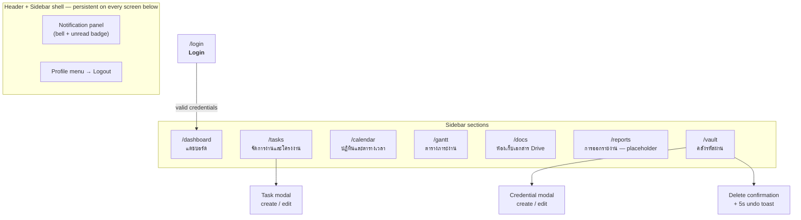
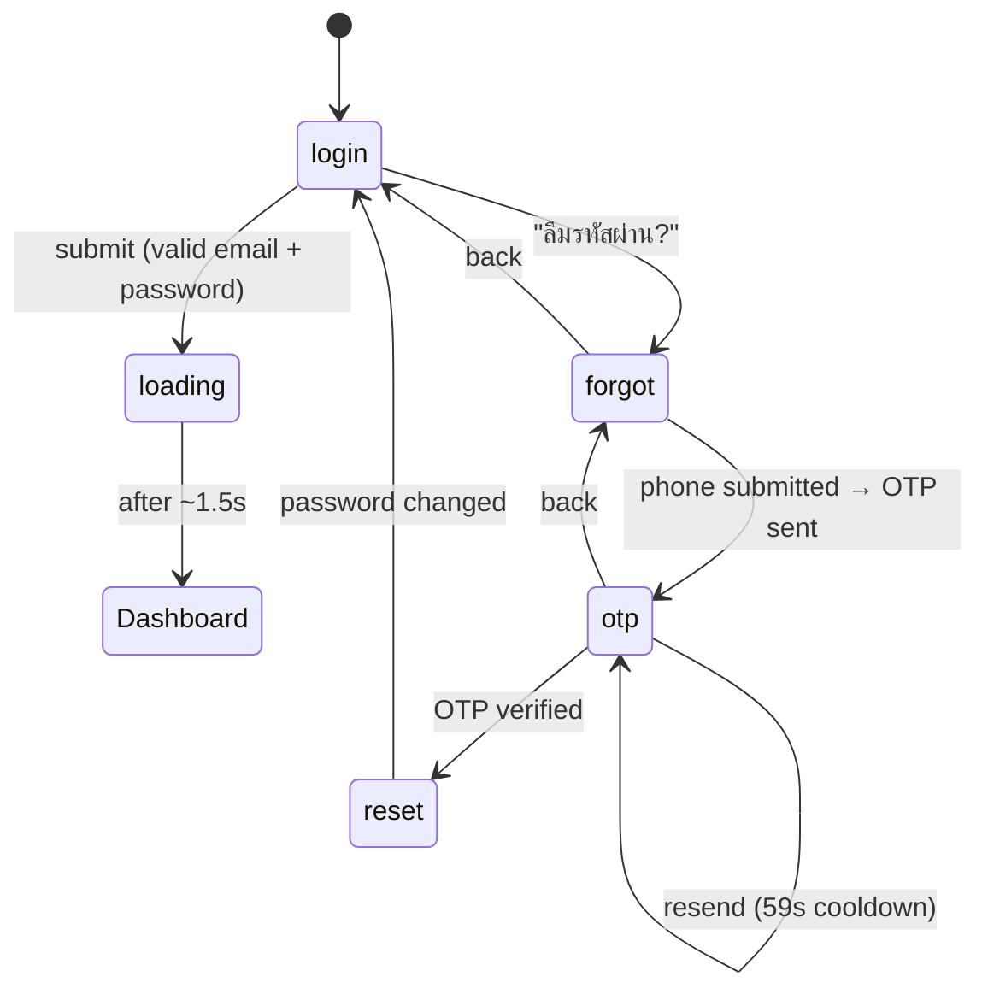
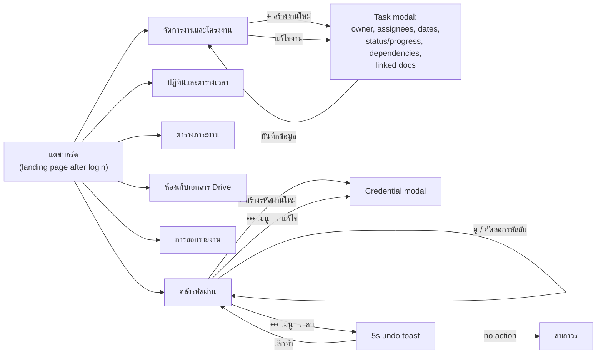

# Wong Workpath — Information Architecture & User Flows

Wong Workpath is an internal, single-tenant tool for project/task management and a credential vault. It's a client-only React SPA — there is no real backend; every domain slice (tasks, employees, documents, credentials, leave requests, notifications) is seeded from mock data and persisted to `localStorage`. Auth is a mock login: any password matches a listed employee email, and the session is restored from a stored user id on reload.

That constraint matters for reading these diagrams: nothing here crosses a network boundary. Every arrow is a client-side state transition or a route change, not an API call.

---

## 1. Information architecture

One public route (`/login`) and seven sidebar sections behind it, all wrapped by a persistent Header + Sidebar shell. Two sections — Tasks and the Credential Vault — open their own modals rather than navigating away.

**Reading it:** the shell (bell + profile menu) isn't a route — it floats above every section below. `/reports` is coded as a static placeholder, not a built-out page. The two modals hang off their parent section rather than getting their own URL, which is why they're drawn as children, not siblings.

---

## 2. User flow — authentication

`Login.tsx` is a five-state machine (`login | forgot | otp | reset | loading`), not just a form. This is worth its own diagram because the states, not the layout, are the thing to understand here.

**What's easy to miss reading the code cold:** `login` matches the typed email against the mock employee directory — there's no real password check, so the only way to fail is a wrong or unlisted email. A "remember me" checkbox on `login` stores the username (not the password) in `localStorage` so it's pre-filled on the next visit. And `otp → forgot` (the back arrow) is a state most flow-diagram tools would draw as forward-only unless you actually read the keydown/back-arrow handlers.

---

## 3. User flow — in-app navigation & primary actions

Every section is one hop from Dashboard via the sidebar. Tasks and the Credential Vault are the two sections with enough internal action structure to be worth expanding — the rest are single-screen views.

**The detail that's easy to flatten away:** deleting a credential isn't instant — it's a soft-delete that hides the item immediately but only actually removes it after a 5-second grace window, reversible via the toast's "เลิกทำ" button. Viewing a decrypted secret is also logged as an audit event (`VIEW_SECURE_DATA`), which the flow above doesn't show but is worth knowing if you're reasoning about the vault's security model.

---

## Scope & assumptions

- Diagrams reflect the routes and components as they exist in `src/App.tsx`, `src/components/layout/Sidebar.tsx`, `src/components/Login.tsx`, and `src/components/CredentialVault.tsx` at the time this was generated — not a specification, a snapshot.
- `/reports` has no dedicated component yet; it's an inline "under development" placeholder in `App.tsx`.
- Calendar, Gantt, and Docs are drawn as single nodes because their internal interactions weren't in scope for this pass — this is a site-level map, not a full feature audit.
