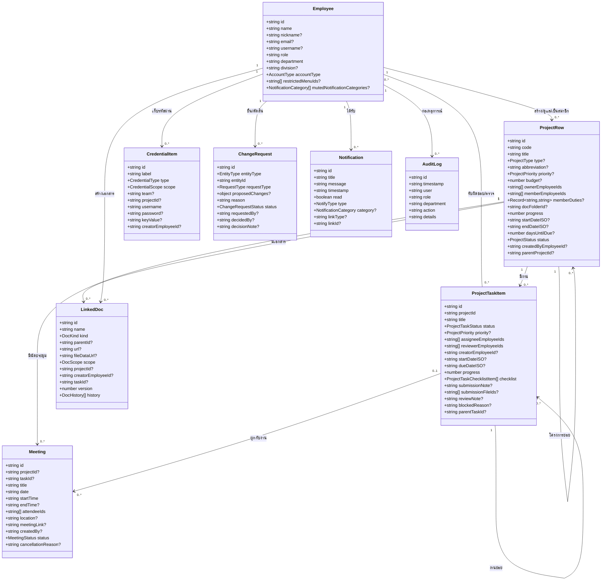

# Class Diagram

ระบบนี้เป็นเว็บแอป React (function components + hooks) ไม่ใช่ระบบเชิงวัตถุ (OOP) แบบมี class จริงๆ "class diagram" ในที่นี้จึงหมายถึง **โครงสร้างข้อมูล (data model) ฝั่งโค้ด TypeScript** ที่ใช้ร่วมกันทั้งแอป (`src/types.ts` และ `src/components/projectBoard/types.ts`) ซึ่งเป็นรูปร่างข้อมูลหลังผ่านการแปลงจากฐานข้อมูลแล้ว (camelCase, วันที่จัดรูปแบบไทยพร้อมกับค่า ISO ดิบ) ไม่ใช่คอลัมน์ฐานข้อมูลตรงๆ — เทียบกับโครงสร้างฐานข้อมูลจริงได้ที่ [ER_Diagram.md](./ER_Diagram.md)

## หมายเหตุประกอบ

- **ProjectRow / ProjectTaskItem มีทั้งฟิลด์วันที่แบบไทย (`startDate`) และแบบ ISO ดิบ (`startDateISO`)** — ฟิลด์ไทยใช้แสดงผลอย่างเดียว ฟิลด์ ISO ใช้ป้อนกลับเข้า `<input type="date">` ตอนแก้ไข ห้ามสลับใช้ผิดที่
- **`daysUntilDue` เป็นค่าคำนวณสด ไม่ถูกเก็บในฐานข้อมูล** คำนวณใหม่ทุกครั้งที่อ่านจากเซิร์ฟเวอร์ (นับแบบเวลาไทย ไม่ใช่ UTC)
- **`ProjectTaskItem.status` มีส่วนที่คำนวณอัตโนมัติ** งานที่มีงานย่อย จะไม่รับค่าสถานะที่ตั้งเอง แต่คำนวณจากงานย่อยเสมอ (ดู `recomputeAncestorStatuses` ฝั่งเซิร์ฟเวอร์)
- **`Employee.accountType`** เป็น enum 4 ค่า (`employee | admin | superadmin | executive`) ตัดสินสิทธิ์ทั้งหมดของระบบ — ดูรายละเอียดที่ [SRS.md](./SRS.md) หมวด non-functional/functional requirements ด้านความปลอดภัย
- Type ทั้งหมดประกาศจริงอยู่ที่ `src/types.ts` (Employee, LinkedDoc, CredentialItem, AuditLog, Meeting, Notification) และ `src/components/projectBoard/types.ts` (ProjectRow, ProjectTaskItem, CustomProjectStatus, CustomProjectType)
