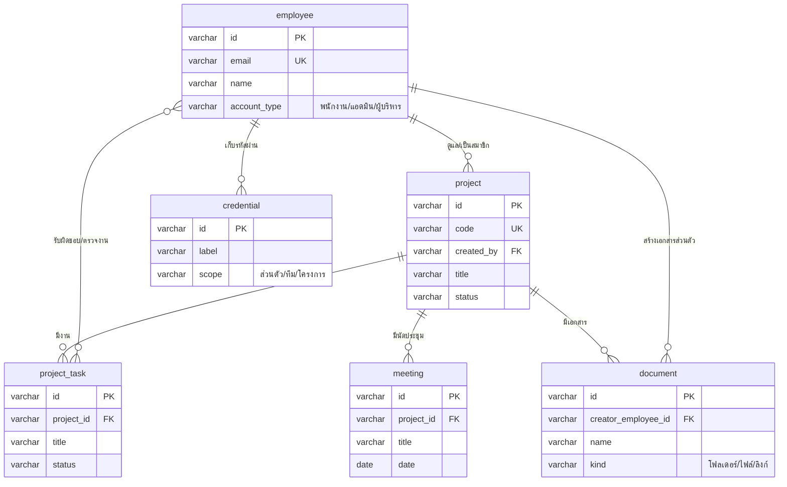

# ER Diagram

ไดอะแกรมนี้ดึงโครงสร้างจากฐานข้อมูล MySQL จริงที่ระบบใช้งานอยู่ (query ตรงจาก `information_schema` วันที่ 2569-09-25) ไม่ใช่จากไฟล์ migration ซึ่งอาจไม่ตรงกับสภาพจริงของฐานข้อมูล 100% ทั้งสองเวอร์ชันด้านล่าง render ผ่านด้วย Mermaid จริงแล้ว

## เวอร์ชันย่อ (แนะนำสำหรับนำเสนอ)

แสดงเฉพาะ 6 ตารางหลักที่เป็นแกนธุรกิจ พร้อม PK/FK/UK ที่มีจริง

## เวอร์ชันเต็ม (16 ตารางทั้งหมดในฐานข้อมูล)

```mermaid
erDiagram
    employee {
        varchar id PK
        varchar name
        varchar email UK
        varchar account_type "employee/admin/superadmin/executive"
        varchar department
        varchar division
    }

    login {
        int id PK
        varchar employee_id FK
        varchar username UK
        varchar password_hash
        boolean is_active
    }

    project {
        varchar id PK
        varchar code UK
        varchar title
        varchar status
        varchar type
        varchar owner_employee_ids "รายการ id, เก็บเป็น JSON ไม่ใช่ FK จริง"
        varchar member_employee_ids "รายการ id, เก็บเป็น JSON ไม่ใช่ FK จริง"
        varchar created_by FK
        varchar parent_project_id FK "โครงการหลัก ถ้าเป็นโครงการย่อย"
    }

    project_task {
        varchar id PK
        varchar project_id FK
        varchar title
        varchar status
        varchar assignee_employee_ids "รายการ id, เก็บเป็น JSON ไม่ใช่ FK จริง"
        varchar reviewer_employee_ids "รายการ id, เก็บเป็น JSON ไม่ใช่ FK จริง"
        varchar creator_employee_id FK
        varchar parent_task_id FK "งานหลัก ถ้าเป็นงานย่อย"
    }

    meeting {
        varchar id PK
        varchar project_id FK
        varchar task_id FK
        varchar attendee_ids "รายการ id, เก็บเป็น JSON ไม่ใช่ FK จริง"
        varchar created_by FK
        enum status "scheduled/cancelled"
    }

    document {
        varchar id PK
        varchar parent_id FK "โฟลเดอร์แม่"
        varchar project_id "ไม่มี FK บังคับจริง"
        varchar task_id "ไม่มี FK บังคับจริง"
        varchar creator_employee_id FK
        enum kind "folder/file/link"
        enum scope "ส่วนตัว/โครงการ"
    }

    credential {
        varchar id PK
        enum scope "ส่วนตัว/ทีม/โครงการ"
        varchar team
        varchar project_id "ไม่มี FK บังคับจริง"
        varchar creator_employee_id "ไม่มี FK บังคับจริง"
    }

    change_request {
        varchar id PK
        enum entity_type "project/project_task/employee"
        varchar entity_id "อ้างได้หลายตาราง ไม่มี FK จริง"
        varchar requested_by FK
        varchar decided_by FK
        enum status "pending/approved/rejected"
    }

    notification {
        varchar id PK
        varchar target_employee_id FK
        varchar category
        enum type "info/success/warning"
    }

    deadline_reminder {
        varchar employee_id PK
        enum entity_type PK "project/task"
        varchar entity_id PK "อ้างได้หลายตาราง ไม่มี FK จริง"
        varchar lead_days "เช่น [2,7,30]"
    }

    org_division {
        varchar id PK
        varchar name UK
    }

    org_section {
        varchar id PK
        varchar division_id FK
        varchar name
    }

    project_custom_status {
        varchar id PK
        varchar label
        varchar created_by FK
    }

    project_custom_type {
        varchar id PK
        varchar label
        varchar created_by FK
    }

    audit_log {
        varchar id PK
        varchar user_name "สำเนาชื่อ ณ ตอนนั้น ไม่ใช่ FK"
        varchar action
    }

    password_reset_otp {
        int id PK
        varchar email "ไม่มี FK บังคับจริง"
        varchar otp_hash
    }

    employee ||--o{ login : "มีบัญชี"
    employee ||--o{ project : "สร้างโครงการ"
    employee }o--o{ project : "เจ้าของ/สมาชิก (JSON)"
    project ||--o{ project : "โครงการย่อย"
    project ||--o{ project_task : "มีงาน"
    employee ||--o{ project_task : "สร้างงาน"
    employee }o--o{ project_task : "ผู้รับผิดชอบ/ผู้ตรวจ (JSON)"
    project_task ||--o{ project_task : "งานย่อย"
    project ||--o{ meeting : "นัดในโครงการ"
    project_task ||--o{ meeting : "ผูกกับงาน"
    employee ||--o{ meeting : "สร้างนัด"
    employee }o--o{ meeting : "ผู้เข้าร่วม (JSON)"
    document ||--o{ document : "โฟลเดอร์ย่อย"
    employee ||--o{ document : "สร้างเอกสาร"
    employee ||--o{ credential : "สร้างรหัสผ่าน (ไม่มี FK จริง)"
    employee ||--o{ change_request : "ยื่นคำขอ"
    employee ||--o{ change_request : "ตัดสินคำขอ"
    employee ||--o{ notification : "ได้รับแจ้งเตือน"
    employee ||--o{ deadline_reminder : "ตั้งเตือนเอง"
    org_division ||--o{ org_section : "มีแผนก"
    employee ||--o{ project_custom_status : "สร้างสถานะเอง"
    employee ||--o{ project_custom_type : "สร้างประเภทเอง"
```

## 3 เรื่องสำคัญที่ต้องรู้ก่อนอ่านไดอะแกรมนี้

1. **ความสัมพันธ์ "หลายต่อหลาย" ไม่ได้ผูกด้วยตารางกลางมาตรฐาน** เช่น `project.owner_employee_ids` / `member_employee_ids`, `project_task.assignee_employee_ids` / `reviewer_employee_ids`, `meeting.attendee_ids` ล้วนเก็บเป็นรายการ id ในคอลัมน์ข้อความเดียว (รูปแบบ JSON เช่น `["E01","E05"]`) ไม่ใช่ FK เดี่ยว ฐานข้อมูลจึงไม่ช่วยตรวจสอบว่า id ในนั้นยังมีตัวตนจริงหรือไม่ โค้ดฝั่งแอปต้องกรองเอง (ดูฟังก์ชัน `resolveValidOwnerIds`/`resolveValidIds`)
2. **บาง FK ถูกถอดออกโดยตั้งใจ** เช่น `document.project_id` เคยมี FK ไปยัง `project.id` แต่ถูกถอดออกด้วย migration `031_drop_document_project_fk.sql` เพื่อให้โค้ดควบคุมการลบ/ย้ายข้อมูลเองได้ยืดหยุ่นกว่าที่ FK cascade จะทำได้
3. **บางตารางอ้างอิงได้หลายประเภท (polymorphic)** เช่น `change_request.entity_id` อาจหมายถึงโครงการ งาน หรือพนักงาน แล้วแต่ค่า `entity_type` และ `notification.link_id`/`link_type` ก็เช่นกัน จึงไม่มี FK ตรงตัวได้ ต้องอ่านคู่กับคอลัมน์ type เสมอ

ดูรายละเอียดทุกคอลัมน์ของทุกตารางที่ [Data_Dictionary.md](./Data_Dictionary.md)
