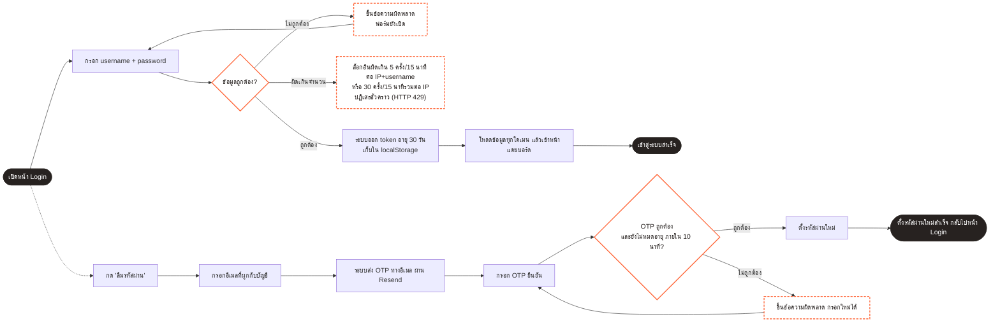
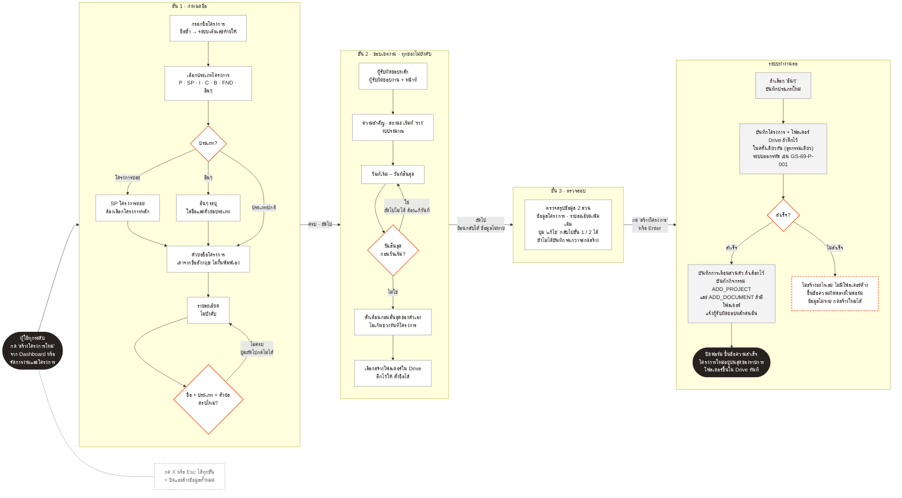
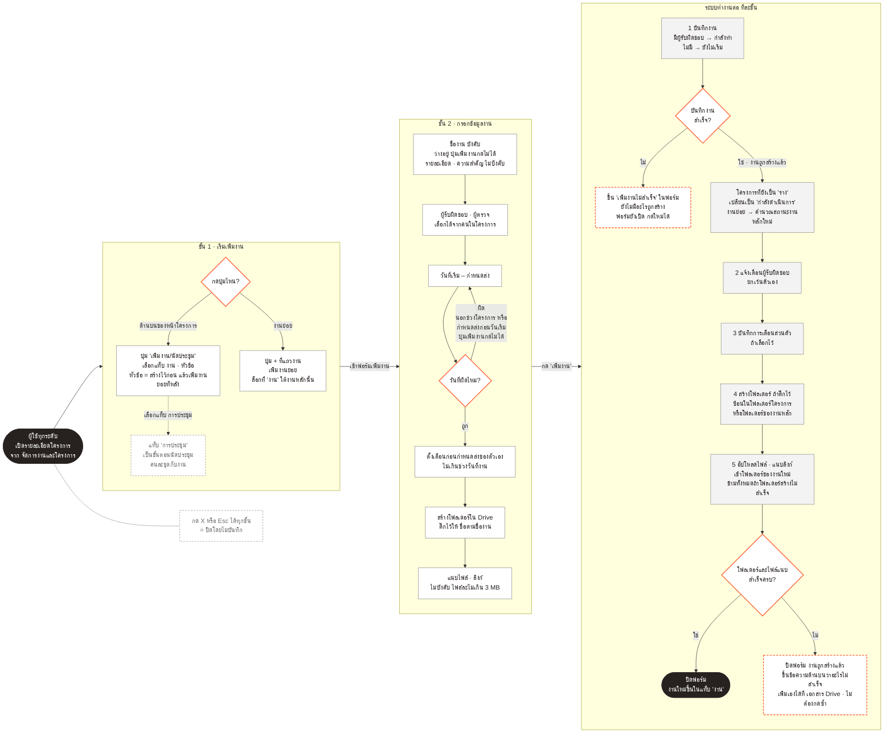
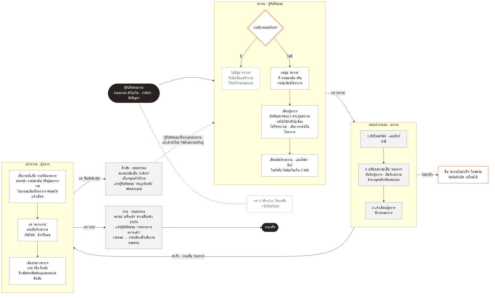

# Flowchart — ผังขั้นตอนการทำงานหลัก

ทุกไดอะแกรมในไฟล์นี้สร้างจากการอ่านโค้ดจริง (ไม่ใช่การออกแบบล่วงหน้า) และผ่านการ render ทดสอบด้วย Mermaid จริงแล้วทุกภาพ

## 1. เข้าสู่ระบบ / ลืมรหัสผ่าน

**ที่ตรวจกับโค้ดแล้ว:** `POST /api/auth/login`, `POST /api/auth/forgot-password`, `POST /api/auth/verify-otp`, `POST /api/auth/reset-password` เป็น 4 endpoint เดียวที่เปิดให้เรียกได้โดยไม่ต้องมี token (นอกจาก `/api/health`)

---

## 2. สร้างโครงการใหม่

**เรื่องสำคัญ:** โฟลเดอร์ Drive ของโครงการต้อง**สร้างพร้อมโครงการในธุรกรรมเดียวกัน** (`POST /api/projects` พร้อม `createFolderName`) — ถ้าอย่างใดอย่างหนึ่งล้มเหลว ต้องไม่มีอะไรถูกสร้างค้างไว้เลย และกดสร้างซ้ำต้องไม่ได้โฟลเดอร์ซ้ำ

---

## 3. สร้างงานใหม่

**เรื่องสำคัญ:** งานถูกบันทึกก่อน แล้วค่อยทำขั้นถัดไป (ตั้งเตือน → สร้างโฟลเดอร์ → แนบไฟล์) ทีละขั้นแยกจากกัน หากขั้นหลังบันทึกงานสำเร็จแล้วมีอะไรพัง **ต้องไม่รายงานเป็น "เพิ่มงานไม่สำเร็จ" และห้ามค้างฟอร์มไว้** เพราะกดซ้ำจะได้งานซ้ำ — ต้องปิดฟอร์มแล้วแจ้งด้วยข้อความแยกว่าอะไรไม่สำเร็จแทน

---

## 4. ส่งงาน / ตรวจงาน

**ข้อจำกัดที่รู้อยู่ (ยังไม่ได้แก้):** การส่งงานอัปโหลดไฟล์ก่อนแล้วค่อยเปลี่ยนสถานะ หากขั้นเปลี่ยนสถานะล้มเหลวหลังอัปโหลดไฟล์ไปแล้ว ไฟล์จะค้างอยู่ใน Drive และกดส่งซ้ำจะอัปโหลดซ้ำอีก (ปัญหาลักษณะเดียวกับที่แก้ไปแล้วในขั้นตอนสร้างงาน แต่ยังไม่ได้แก้จุดนี้)
