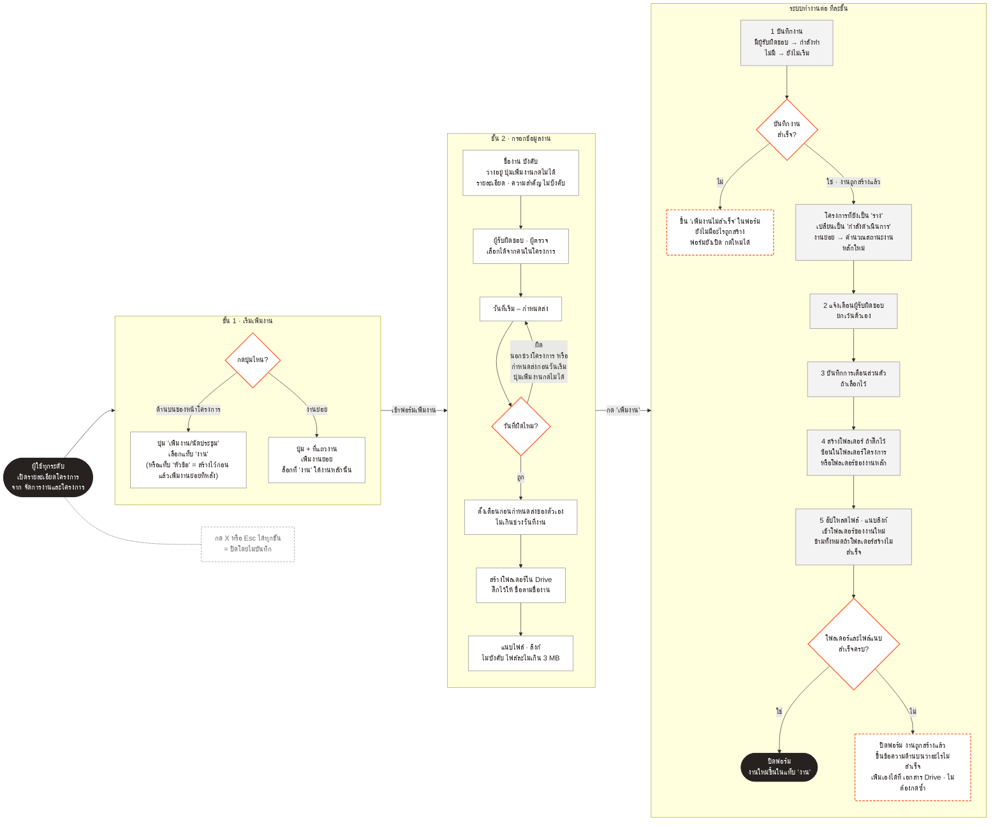

# Flowchart — เพิ่มงาน (เฉพาะงาน ไม่รวมนัดประชุม)

เวอร์ชันตัดทอนของ "สร้างงานใหม่" ใน [Flowchart.md](./Flowchart.md) หัวข้อที่ 3 — ตัดเส้นทางแท็บ "การประชุม" ออก เหลือเฉพาะการเพิ่มงาน/งานย่อย สำหรับใช้เมื่อไม่ต้องการให้ผังพูดเรื่องนัดประชุมปนอยู่ (เช่น ใส่สไลด์เฉพาะเรื่องงาน) เนื้อหาที่เหลือเหมือนกับ Flowchart.md ทุกจุด

**ต่างจาก Flowchart.md ตรงไหน:** ตัดโหนด "แท็บการประชุม" และเส้น `A2 -.-> A4` ออกเท่านั้น ส่วนที่เหลือ (ขั้น 2, ระบบทำงานต่อ, กรณีสำเร็จ/ล้มเหลว) เหมือนกันทุกจุด — ถ้าอยากดูเวอร์ชันที่รวมนัดประชุมด้วย ดูที่ [Flowchart.md](./Flowchart.md) หัวข้อที่ 3
